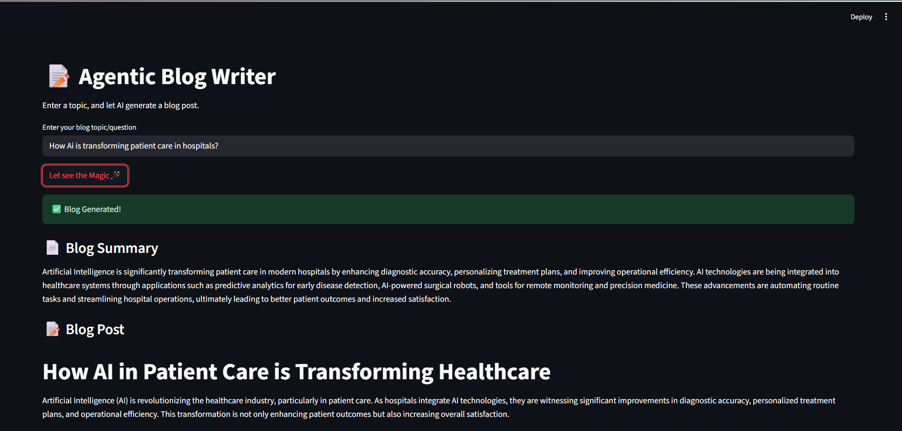
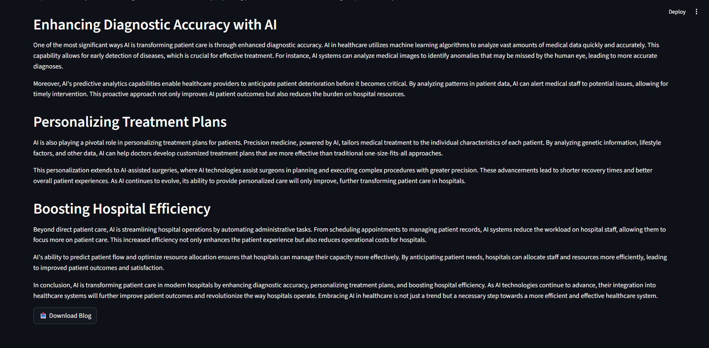
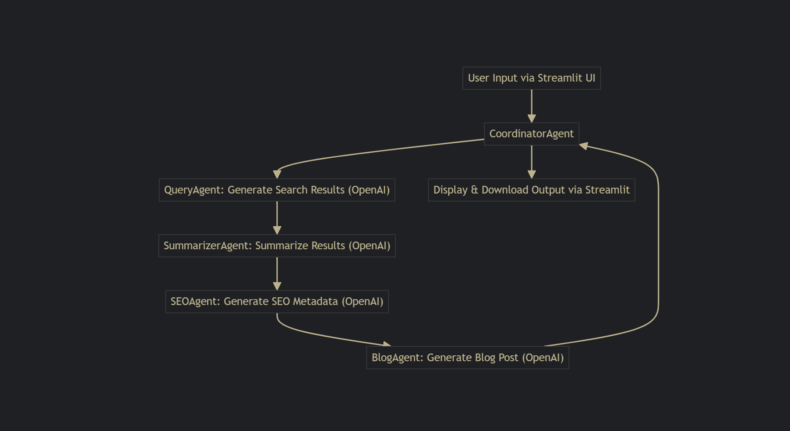

<div align="center">

# 📝 Agentic Blog Writer

Generate SEO-optimized, research-backed blog posts using AI agents through a clean Streamlit UI.

</div>

<div align="center">


</div>
<div align="center">

  
  <br><br>
  
  <br><br>
  

</div>

## 📋 Table of Contents

1. 🤖 [Introduction](#introduction)  
2. ⚙️ [Tech Stack](#tech-stack)  
3. 🔋 [Features](#features)  
4. 🚀 [Quick Start](#quick-start)


## 🤖 Introduction

**AI Blog Generator** is an agentic, fully automated blog writing platform powered by Langroid and OpenAI.

Just enter a topic or question, and the system will:

- 🧠 Extract the best SEO keyword  
- 🔎 Simulate research with realistic search results  
- ✍️ Summarize findings and generate SEO metadata  
- 📝 Write a full markdown blog post  

All orchestrated by a **Coordinator Agent** and presented in a modern **Streamlit UI**.


## ⚙️ Tech Stack

- **Python 3.11+** – Core programming language  
- **Streamlit** – Interactive frontend for the UI  
- **OpenAI API** – Powering all LLM-based tasks  
- **Langroid** – Multi-agent coordination and task delegation  
- **dotenv** – For managing environment variables  
- **pytest** – For automated testing and validation

## 🔋 Features

👉 **Multi-Agent Pipeline**  
Modular agents handle tasks like research, summarization, SEO generation, and blog writing.

👉 **Realistic Research Simulation**  
LLM-generated search results simulate real-world information gathering.

👉 **SEO-Optimized Output**  
Automatically extracts keywords and generates SEO-friendly metadata.

👉 **Markdown Blog Export**  
Generates clean, well-structured blog posts in markdown format — ready to publish.

👉 **Modern Streamlit UI**  
A simple, interactive interface for seamless user experience.

👉 **Fully Automated**  
Just enter a topic and let the system do the rest — end-to-end automation.

👉 **Test Coverage**  
Includes automated tests to ensure reliability and maintainability.

## <a name="quick-start">🤸 Quick Start</a>

Follow these steps to set up the project locally on your machine.

**Prerequisites**

Make sure you have the following installed on your machine:

- [Python 3.11+](https://www.python.org/downloads/)
- [Git](https://git-scm.com/)

**Cloning the Repository**

```bash
git clone https://github.com/your-username/ai-blog-generator.git
cd ai-blog-generator
```
**Setting Up the Virtual Environment**

```
python -m venv venv
# On Windows
venv\Scripts\activate
# On macOS/Linux
source venv/bin/activate
```

**Installation**

Install the project dependencies using pip:

```bash
pip install -r requirements.txt
pip install langroid openai python-dotenv
```

**Set Up Environment Variables**

Create a new file named `.env` in the root of your project and add the following content:

```env
OPENAI_API_KEY=your_openai_api_key
```

Replace the placeholder values with your actual credentials

**Running the Project**

```bash
streamlit run app.py
```
Open [http://localhost:8501](http://localhost:8501) in your browser to view the project.


